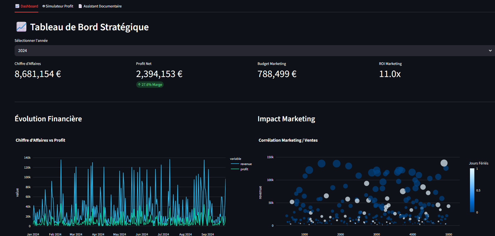

# 🧠 AI Decision Support System

> **Plateforme intelligente d'aide à la décision** combinant Machine Learning et IA Générative pour transformer vos données en insights actionnables.


## 📸 Aperçu


*Tableau de bord stratégique avec KPIs en temps réel*

---

## ✨ Fonctionnalités

### 📊 Dashboard Stratégique
- **KPIs financiers** : Chiffre d'affaires, profit, marge
- **Graphiques interactifs** : Évolution temporelle et analyse marketing
- **Filtres dynamiques** : Par année, région, produit

### 🔮 Simulateur IA
- **Prédiction de profit** basée sur Random Forest
- **Interface intuitive** avec sliders et jauge visuelle
- **Scénarios what-if** : Testez différentes stratégies

### 📄 Assistant Documentaire (RAG)
- **Upload de PDFs** : Rapports, factures, contrats...
- **Chatbot intelligent** : Posez des questions en langage naturel
- **Mémoire contextuelle** : L'IA se souvient de vos documents

---

## 🚀 Installation Rapide

### Prérequis
- Python 3.10+
- Compte Google AI (pour le RAG)

### Étapes

1️⃣ **Cloner le projet**
```bash
git clone https://github.com/medboukechouch/ai-decision-support-system.git
cd ai-decision-support-system
```

2️⃣ **Créer un environnement virtuel** (recommandé)
```bash
python -m venv venv
source venv/bin/activate  # Sur Windows : venv\Scripts\activate
```

3️⃣ **Installer les dépendances**
```bash
pip install -r requirements.txt
```

4️⃣ **Configuration**
Créez un fichier `.env` à la racine :
```env
GOOGLE_API_KEY=votre_cle_api_ici
```
> 🔑 Obtenez votre clé sur [Google AI Studio](https://makersuite.google.com/app/apikey)

---

## ▶️ Lancement

**Terminal 1** : Démarrer l'API
```bash
python -m uvicorn backend.main:app --reload
```

**Terminal 2** : Lancer l'interface
```bash
streamlit run frontend/app.py
```

🌐 Ouvrez votre navigateur sur : **http://localhost:8501**

---

## 📁 Structure du Projet

```
ai-decision-support-system/
├── backend/
│   ├── main.py              # API FastAPI
│   ├── data/
│   │   └── business_data.csv  # Données d'entraînement
│   └── models/
│       └── model.pkl         # Modèle ML pré-entraîné
├── frontend/
│   └── app.py               # Interface Streamlit
├── requirements.txt
├── .env                     # Configuration (à créer)
└── README.md
```

---

## 🎓 Utilisation

### Exemple : Prédire le profit du prochain mois

1. Allez dans l'onglet **"🤖 Simulateur IA"**
2. Configurez :
   - Budget marketing : 2500€
   - Stock : 300 unités
   - Période de vacances : Non
3. Cliquez sur **"Lancer la Simulation"**
4. Analysez la jauge de profit et la recommandation

### Exemple : Analyser un rapport PDF

1. Onglet **"📄 Assistant Documentaire"**
2. Uploadez votre PDF
3. Posez une question : *"Résume les points clés de ce rapport"*
4. L'IA génère une réponse contextuelle

---

## 🔧 Résolution de Problèmes

### ❌ Erreur : "Impossible de contacter l'API"
**Solution** : Vérifiez que l'API est bien lancée sur le port 8000
```bash
curl http://127.0.0.1:8000/health
```

### ❌ Erreur : "GOOGLE_API_KEY not found"
**Solution** : Créez le fichier `.env` avec votre clé API

### ❌ Les graphiques ne s'affichent pas
**Solution** : Vérifiez que `business_data.csv` existe dans `backend/data/`

---

## 📊 Technologies Utilisées

| Composant | Technologie |
|-----------|-------------|
| **Backend** | FastAPI, Uvicorn |
| **Frontend** | Streamlit, Plotly |
| **Machine Learning** | Scikit-learn, Pandas |
| **IA Générative** | Google Gemini (RAG) |
| **Vectorisation** | FAISS, Sentence Transformers |

---

## 🚀 Améliorations Futures

- [ ] Authentification utilisateur
- [ ] Base de données PostgreSQL
- [ ] Export des rapports en PDF
- [ ] Mode multi-langue
- [ ] Notifications par email

---

## 📝 License

MIT License - Libre d'utilisation et de modification

---

## 👨‍💻 Auteur

**BOUKECHOUCH MOHAMED**  
📧 Email : med.boukechouch@gmail.com  
🔗 LinkedIn : [mohamed-boukechouch](https://www.linkedin.com/in/mohamed-boukechouch)

---

⭐ **Si ce projet vous plaît, n'oubliez pas de lui donner une étoile !**
```

